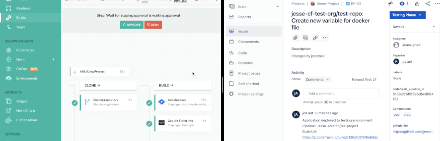
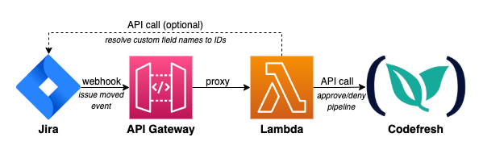

# Codefresh Jira Event Listener

This application will receive webhooks from Jira and use the change state information to approve or deny a [Codefresh](https://codefresh.io/) pipeline. This allows moving issues in Jira to continue a pipeline's run. Jira tickets must have a field that stores the pipeline ID. This can be handled by the pipeline creating or enhancing the Jira ticket with that information using the [Jira Issue Manager](https://codefresh.io/steps/step/jira-issue-manager) Codefresh step.



The produced contianer is intended to be run as a Lambda function.

## Container Configuration

The following environment variables may be set. Variables listed with a (*) are required.

**Environment variables:**

- `CODEFRESH_API_KEY` (*) - The api key with pipeline approve permissions for codefresh
- `CODEFRESH_BASE_URL` - The base URL to reach the codefresh API on. Defaults to `g.codefresh.io` (SAAS instance)
- `CODEFRESH_PORT` - The port to reach codefresh on. Defaults to `443` (SAAS instance)
- `WEBHOOK_SECRETS` - One or more (comma seperated) secrets for webhook(s). If set a webhook must include a parameter called `webhook_secret` that matches a key in this list. If not set, no validation will be done on this parameter
- `JIRA_APPROVE_STATES` (*) - One or more (comma seperated) states in Jira that will cause the pipeline to be approved.
- `JIRA_DENY_STATES` (*) - One or more (comma seperated) states in Jira that will cause the pipeline to be denied.
- `JIRA_EVENT_TYPES` - One or more (comma seperated) event types from Jira to read the payload from. Defaults to `issue_moved`
- `JIRA_RESOLVE_FIELDS` - Resolve the custom field ID based on a provided name. Requires API endpoint, username and token. Defaults to `false`
- `JIRA_CUSTOM_FIELD` (*) - The custom field ID (i.e. `customfield_#####`) or name (if `JIRA_RESOLVE_FIELDS` is `true`) to look for a pipeline ID in. See the Jira section for how to generate this.
- `JIRA_BASE_URL` - The base url to communicate with the Jira API. Should be of the form `<jira org>.atlassian.net` (must be set if `JIRA_RESOLVE_FIELDS` is `true`)
- `JIRA_PORT` - The port to communicate with the Jira API on. Defaults to `443`
- `JIRA_USERNAME` - The email address assocaited with your Atlassian account. Used for API authentication (must be set if `JIRA_RESOLVE_FIELDS` is `true`)
- `JIRA_TOKEN` - Jira token for API communication (must be set if `JIRA_RESOLVE_FIELDS` is `true`)
- `DEBUG` - Turn debug mode on. Defaults to `false`

# Setup

To make use of this function, some setup is required in Codefresh, AWS, and Jira. This section will walk you through what is needed.



## Codefresh

Create an API token. Navigate to your [user settings](https://g.codefresh.io/user/settings), scroll down to **API Keys** and click the **GENERATE** button. Provide a meaningful name for this key and give it the permission **approve** listed under the Pipeline header. Save this token for use with our Lambda function

## AWS

We will create a Lambda function using this contianer and related resources to create our webhook listener

### ECR

Add this image to a private ECR repository. To do so, create a private ECR repository with a name like "codefresh-jira-event-listener" and run the following commands:

```bash
PRIVATE_ECR_REPO="<account_number>.dkr.ecr.<region>.amazonaws.com/<repo_name>"
docker pull public.ecr.aws/o8p6n2q5/codefresh-jira-event-listener:1.0.1
docker tag public.ecr.aws/o8p6n2q5/codefresh-jira-event-listener:1.0.1 ${PRIVATE_ECR_REPO}:1.0.1
docker push ${PRIVATE_ECR_REPO}:1.0.1
```

### Lambda

In AWS go to Lambda, and navigate to the **functions** tab. Click the **Create function**:

1. Select **Container Image** at the top
1. Name your function something like "CodefreshJiraEventListener".
1. Browse to find the private image we just pushed, and click **Create function**

Once the funciton is created it will take you to the the function's page. Click the **Configuration** tab and navigate to **Environment Variables**. Add the variables as described in the [Container Configuration](#container-configuration) section of this document

### API Gateway

When all the environment variables are created, click the **+ Add trigger** button in the Lambda function's overview:

1. Select **API Gateway** as the trigger type.
1. Create a new **REST API**.
1. Set **Security** to **Open**.
1. Click the **Add** button to create this gateway.

If skipping the **Custom Route 53 DNS (optional)** section, navigate to your API gateway's settings and copy the **Default endpoint** URL

### Custom Route 53 DNS (optional)

Navigate to the API gateways. THe one we just created should be present and to use the Lambda function we set up.

1. Click **Custom domain name**
1. Click **Create**
1. Provide a (sub)domain to use with your function
1. Use **TLS 1.2** as the minimum TLS version
1. Use a **Regional** endpoint
1. Create and use an ACM certificate for use with this DNS entry
1. Click **Create domain name**

Connect the domain name to our gateway:

1. Select the newly created domain name in the custom domain name list.
1. Select the **API Mapping** tab.
1. Click **Configure API mappings**.
1. Click **Add new mapping**.
    1. API - The API we created in the previous section
    2. Stage - default
    3. Path - leave blank

Create the domain name in Route53
1. Navigate to the appropriate (public) **Hosted zone** in **Route 53**.
1. Click the **Create record** button.
    1. Name your record the same as your custom domian name from the previos steps
    1. Record type: A Record
    1. Route traffic to **Alias** (on)
    1. Choose endpoint dropdown
        1. **Alias to API Gateway API**
        1. Select the region
        1. Select the matching endpoint
    1. Click **Create Record**


(Optional) Disable the default API Gateway endpoint

1. Navigate to the API gateway we created.
1. In the sidebar under **API: <our gateway name>**, select **Settings**
1. Select **Disabled** for **Default endpoint**.
1. Click the **Save Changes** button at the bottom


## Jira

As a Jira Admin, we will create a webhook and update our workflows to use it.

### Webhook

Create a webhook to trigger our Lambda function

1. Click the cog wheel at the top right of Jira.
1. Select **System** under **Jira Settings** from the menu
1. Select **WebHooks** from the left-hand navigation
1. Click **+ Create Webhook**
    1. Name your webhook something memorable like **Codefresh Lambda Function**
    1. Use the URL of your API gateway as the URL.
    1. Add the following parameters at the end of the url `?issue_id=${issue.id}&issue_key=${issue.key}&project_key=${project.key}&webhook_secret=<your webhook secret>`
    1. Select **Issue** > **updated** as the event type
    1. Click the **Create** button

### Custom Fields

Create a custom field to track our Codefresh Pipeline ID

1. Click the cog wheel at the top right of Jira.
1. Select **System** under **Jira Settings** from the menu
1. Select **Custom fields** from the left-hand navigation
1. Click **Create custom field**
    1. Type: **Short text (plain text only)**
    1. Click **Next**
    1. Name: **codefresh_pipeline_id**
    1. Description: **The id of the codefresh pipeline**
    1. Click **Create**
    1. Assign it to your screens
1. Find your custom field in the list, click the three dots (**...**) and click **Edit**
    1. Copy the id from the end of URL. It should be of the form **?id=######**
    1. This will be used for our **CUSTOM_FIELD** environment variable for our Lambda function.

### Workflow

Update our workflow to use our webhook.

1. Click the cog wheel at the top right of Jira.
1. Select **System** under **Jira Settings** from the menu
1. Select **Workflow** from the left-hand navigation
1. Edit an active workflow
    1. Select the transitions
    1. Click **Post functions**
    1. **Add Post Function**
        1. Name: **Trigger a webhook**
        1. Click **Add**
        1. Select the webhook we created (i.e. **Codefresh Lambda Function**)
        1. Click **Add**
    1. If event type is not **Issue Moved** for the transition (**Fire a <event type> event that can be processed by the listeners.**), edit this line and select **Issue Moved** (other event types supported, see **EVENT_TYPES** environment variable)


### API Key (optional)

If you would like to use friendly names for custom fields in Jira and let the function resolve those to the custom field ID, you will need to create an Atlassian API key.

1. From Jira, click on your user icon and select [**Account Settings**](https://id.atlassian.com/manage-profile/profile-and-visibility)
1. Click the [**Security**](https://id.atlassian.com/manage-profile/security) tab.
1. Click [**Create and manage API tokens**](https://id.atlassian.com/manage-profile/security/api-tokens)
1. Click **Create API token** and provide a memorable name like: *Codefresh-lambda-token*
1. Save the generated token

To make use of this token, set the following environment variables in Lambda:

- `JIRA_RESOLVE_FIELDS` = `true`
- `JIRA_BASE_URL` = the base url for your jira instance (i.e. `<jira org>.atlassian.net`)
- `JIRA_USERNAME` = The email address assocaited with your Atlassian account
- `JIRA_TOKEN` - The token you just generated
- `JIRA_CUSTOM_FIELD` - The name you gave your custom field
